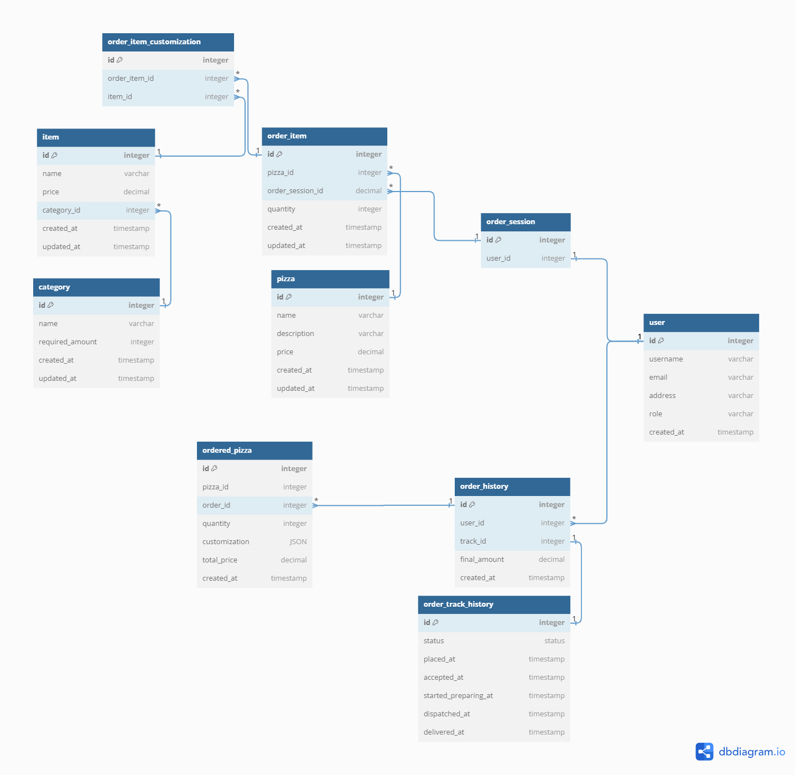

# Hot Fresh Pizza🍕



## Notes:

* All endpoints can be explored and tried at **Swagger UI** -> [http://127.0.0.1/api/schema/docs/](http://127.0.0.1/api/schema/docs/)
* `pizzeria/management/commands/setup_test_data.py` creates test data, can be used as a management command
* category.required_amount field + serializer validation is used to impose business restriction of 1 Base, 1 Cheese, 5 Toppings
* A celery tasks at `audit/tasks.py` recursively updates the order status
* `db_design.png` shows all tables and relations.

#### Here's how frontend gonna use few of the APIs:

1. add/modify pizzas to his/her order -> [**POST**,**PATCH**] `/api/pizzeria/orderitem/`
2. review order -> [**GET**] `/api/pizzeria/order`
3. place order -> [**POST**] `/api/pizzeria/order/place-order`
4. track order -> [**GET**] `/api/audit/track/{id}/`


## Docker:
* system prerequisites: Docker and Docker Compose
* if you tried local setup before this, paste content from `settings_docker.py` to `settings.py`
* [http://127.0.0.1/api/schema/docs/](http://127.0.0.1/api/schema/docs/)
```
sudo docker-compose build
sudo docker-compose up
```

## Local Setup:
1. replace the content of `settings.py` file with `settings_local.py` file
2. create venv, using 
    `python -m venv venv`
3. activate the environment 
    ``` BASH
    Ubuntu `source venv/bin/activate`
    Windows Powershell `venv\Scripts\Activate.ps1`
    Windows CMD `venv\Scripts\activate.bat`
    ```
4. install dependencies
    `pip install -r requirements.txt`
5. connect with local DB instance at `project/settings.py`
    ```
    DATABASES = {
        'default': {
            'ENGINE': 'django.db.backends.<db_name>',
            'NAME': '<schema_name>',
            'USER': '<user_name>',
            'PASSWORD': '<password>',
            'HOST':'localhost',
            'PORT':'3306',
        }
    }

    # change redis server's port, default is 6379
    CELERY_BROKER_URL = "redis://localhost:6379"
    CELERY_RESULT_BACKEND = "redis://localhost:6379"
    ```
6. make migrations, migrate, generate test pizzas and runserver

    ``` Bash
    python manage.py makemigrations
    python manage.py migrate

    python manage.py setup_test_data

    python manage.py runserver 8000
    ```
7. start redis server
    ```
    > redis-server
    ```
8. start celery worker
    ```
    > celery --app=flagship  worker -l INFO --pool=solo
    ```
